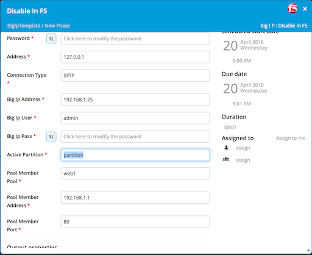
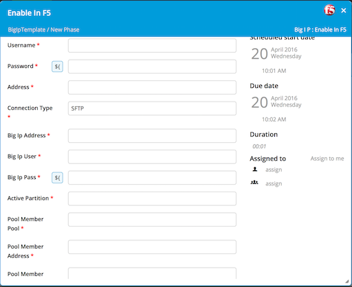

**XL Release Big IP Plugin**

**Introduction:**
This document describes the functionality provided by the F5 BIG-IP plugin.

Refer to **XL Deploy Reference Manual** for background information on XL Deploy and deployment concepts.

The BIG-IP plugin is a XL Deploy plugin that adds capability for managing deployments done to application and web servers whose traffic is managed by a BIG-IP load-balancing device.

**Installation:**

Copy the plugin file to the XL Release plugin folder and restart the XL Release server. 

Install Python 2.7.x and the additional [pycontrol](https://pypi.python.org/pypi/pycontrol) and [suds](https://pypi.python.org/pypi/suds) libraries on the host that has access to the BIG-IP load balancer device.

**Configuring an Example Template:**

The **Big IP plugin** provides XL Release the ability to manage load balancing in Big IP F5 devices.  You can add steps to your release to add and remove members from load balancing pools in the F5.

**Disable Pool:**

 
The F5 tasks require XL Release to execute a python script in the OS.  For this reason the F5 tasks

 
 

**References:**

* XL Deploy [bigipPluginManual](https://docs.xebialabs.com/xl-deploy-bigip-plugin/4.0.x/bigipPluginManual.html)

* XL Deploy [f5-big-ip-plugin](https://docs.xebialabs.com/xl-deploy/concept/f5-big-ip-plugin.html)

